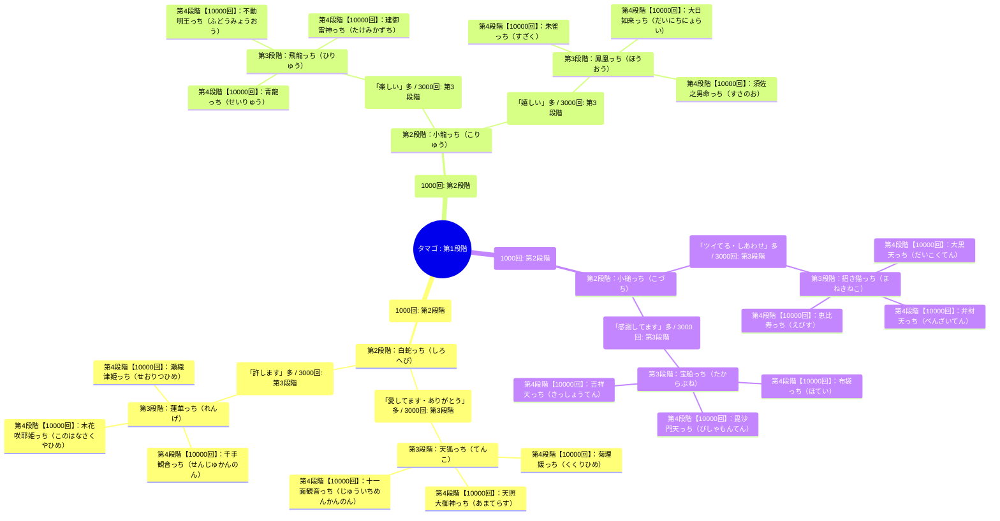

# 言霊進化ツリー (最終形態 追加版)

ObsidianなどのMarkdownエディタにそのまま貼り付けてプレビューすることができます。

```mermaid
mindmap
  root((タマゴ : 第1段階))
    Aルート：愛情・受容系 (1000回: 第2段階)
      第2段階：白蛇っち（しろへび）
        A-1分岐 (「愛してます・ありがとう」多 / 3000回: 第3段階)
          第3段階：天狐っち（てんこ）
            第4段階【10000回】：天照大御神っち（あまてらす）
            第4段階【10000回】：菊理媛っち（くくりひめ）
            第4段階【10000回】：十一面観音っち（じゅういちめんかんのん）
        A-2分岐 (「許します」多 / 3000回: 第3段階)
          第3段階：蓮華っち（れんげ）
            第4段階【10000回】：千手観音っち（せんじゅかんのん）
            第4段階【10000回】：木花咲耶姫っち（このはなさくやひめ）
            第4段階【10000回】：瀬織津姫っち（せおりつひめ）
    Bルート：喜び・快活系 (1000回: 第2段階)
      第2段階：小龍っち（こりゅう）
        B-1分岐 (「楽しい」多 / 3000回: 第3段階)
          第3段階：飛龍っち（ひりゅう）
            第4段階【10000回】：青龍っち（せいりゅう）
            第4段階【10000回】：不動明王っち（ふどうみょうおう）
            第4段階【10000回】：建御雷神っち（たけみかずち）
        B-2分岐 (「嬉しい」多 / 3000回: 第3段階)
          第3段階：鳳凰っち（ほうおう）
            第4段階【10000回】：朱雀っち（すざく）
            第4段階【10000回】：大日如来っち（だいにちにょらい）
            第4段階【10000回】：須佐之男命っち（すさのお）
    Cルート：感謝・幸運系 (1000回: 第2段階)
      第2段階：小槌っち（こづち）
        C-1分岐 (「ツイてる・しあわせ」多 / 3000回: 第3段階)
          第3段階：招き猫っち（まねきねこ）
            第4段階【10000回】：大黒天っち（だいこくてん）
            第4段階【10000回】：弁財天っち（べんざいてん）
            第4段階【10000回】：恵比寿っち（えびす）
        C-2分岐 (「感謝してます」多 / 3000回: 第3段階)
          第3段階：宝船っち（たからぶね）
            第4段階【10000回】：毘沙門天っち（びしゃもんてん）
            第4段階【10000回】：布袋っち（ほてい）
            第4段階【10000回】：吉祥天っち（きっしょうてん）
```
